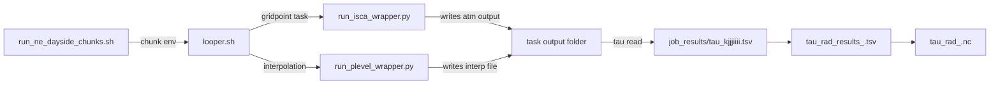

# Document Design for Radiative Timescale Workflow

This document describes an A4 layout for illustrating the workflow across the four key files:
- `run_ne_dayside_chunks.sh`
- `looper.sh`
- `run_isca_wrapper.py`
- `run_plevel_wrapper.py`

## Suggested A4 Layout

1. **Header**
   - Title: `Radiative Timescale Computation Workflow`
   - Subtitle: `Chunked gridpoint perturbation, Isca execution, interpolation, and output assembly`

2. **Top row**: four boxes representing the source scripts.
   - Box 1: `run_ne_dayside_chunks.sh`
   - Box 2: `looper.sh`
   - Box 3: `run_isca_wrapper.py`
   - Box 4: `run_plevel_wrapper.py`

3. **Middle row**: a data flow / process flow diagram showing how control and files move between the scripts.

4. **Bottom row**: outputs and final file products.
   - `job_results/*.tsv`
   - `tau_rad_results*.tsv`
   - `tau_rad*.nc`
   - `kXXX_jYYY_iZZZ/` directories

## Box Contents

### Box 1: `run_ne_dayside_chunks.sh`
- Purpose: orchestrates north-east dayside execution in 32-gridpoint chunks.
- Inputs:
  - fixed `J_MIN=32..63`, `I_MIN=0..31`
  - K ranges: `36..47`, `24..35`, `12..23`, `0..11`
  - environment overrides: `TASK_OFFSET`, `TASK_COUNT`, `RUN_ID`, `N_PARALLEL`, `VERBOSE`
- Output:
  - repeated calls to `looper.sh` with chunk-specific environment
- Notes:
  - calculates `offset`, `chunk_id`, and descriptive `RUN_ID`
  - each call processes one 32-point subset

### Box 2: `looper.sh`
- Purpose: main gridpoint-level workflow for one chunk.
- Core steps:
  1. select gridpoints inside `K_MIN..K_MAX`, `J_MIN..J_MAX`, `I_MIN..I_MAX`
  2. skip first `TASK_OFFSET` points and process up to `TASK_COUNT`
  3. for each point, run `process_gridpoint()` in parallel
- Per-task work:
  - copy original restart archive
  - perturb `atmosphere.res.nc` and `spectral_dynamics.res.nc`
  - run Isca wrapper
  - run interpolation wrapper
  - compute tau and write `job_results/tau_*.tsv`
- Final assembly:
  - sort per-task TSVs into `tau_rad_results*.tsv`
  - build `tau_rad*.nc`

### Box 3: `run_isca_wrapper.py`
- Purpose: isolate Isca execution for one task.
- Key behavior:
  - loads experiment module from the experiment script
  - optionally sets `exp.datadir` to the task output root
  - optionally sets `exp.workdir` and `exp.rundir` to a unique per-task folder under `GFDL_WORK`
  - invokes `module.exp.run(...)`
- Inputs:
  - experiment script path
  - run number
  - restart archive path
  - number of cores
  - output folder root
  - task ID for isolation
- Output:
  - `point_root/run000X/` Isca output folder

### Box 4: `run_plevel_wrapper.py`
- Purpose: pressure-level interpolate a single task output.
- Key behavior:
  - selects `atmos_monthly.nc` from task output location
  - changes working directory to the task-specific output folder
  - calls `plevel_call(...)` from `plevel_fn.py`
  - writes `atmos_monthly_interp_full.nc`
- Inputs:
  - plevel script directory
  - experiment name
  - run number
  - task base dir
  - task output dir

## Data Flow Diagram (Mermaid)

## Suggested A4 Sections

- **Section 1: Overview**
  - One-sentence summary of the overall goal
  - The four-file workflow map

- **Section 2: Chunk driver**
  - Explain `run_ne_dayside_chunks.sh`
  - Why chunking is needed
  - Example chunk call

- **Section 3: Gridpoint workflow**
  - Explain selection via `TASK_OFFSET`/`TASK_COUNT`
  - Explain `process_gridpoint()` stages

- **Section 4: Wrapper roles**
  - `run_isca_wrapper.py` isolates Isca workdir and output
  - `run_plevel_wrapper.py` runs pressure-level interpolation in a safe per-task directory

- **Section 5: Outputs**
  - per-task TSVs
  - merged master TSV
  - final 3D NetCDF
  - per-gridpoint output folders

## Visual styling suggestions

- Use color-coded boxes:
  - blue for shell scripts
  - green for Python wrappers
  - orange for outputs
- Draw arrows for control flow and file flow separately:
  - solid arrows for script invocation
  - dashed arrows for data files
- Label the `TASK_OFFSET` / `TASK_COUNT` step clearly in the `looper.sh` box.
- Add a note about `GFDL_WORK` isolation in the `run_isca_wrapper.py` box.

## Optional additional box

- `plevel_fn.py` / `plevel.sh`
  - note that the interpolation wrapper calls an existing legacy pressure-level interpolation tool
  - mention that this is why the wrapper must `chdir` to the per-task output folder

## Recommended final note

Include a short caution:
- `micromamba activate isca_env` must succeed before `looper.sh` runs
- environment variables `GFDL_WORK`, `GFDL_BASE`, and `GFDL_ENV` are required for the interpolation step
- `RUN_ID` isolates output folders so multiple chunk runs may coexist
